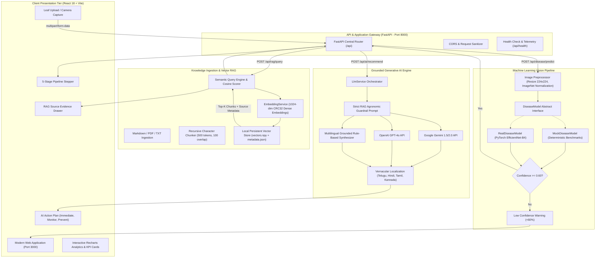
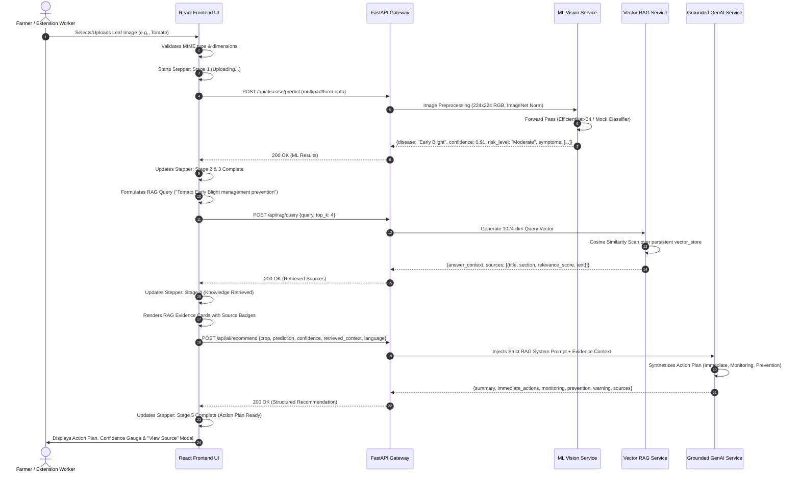

# 02. System Architecture & Data Flow

## 1. High-Level Architectural Topology

AgriSense AI adopts a modern, decoupled microservices-ready architecture consisting of:
1. **Presentation Layer (Client):** Responsive Single-Page Application (SPA) built with React 18, TypeScript, Tailwind CSS, Vite, Framer Motion, and Recharts.
2. **Application Gateway & API Layer:** Python 3.10+ FastAPI framework with asynchronous non-blocking event loops, Pydantic v2 data validation schemas, and automated OpenAPI (Swagger) generation.
3. **Machine Learning Vision Engine:** Modular computer vision classification pipeline supporting transfer learning architectures (EfficientNet-B4 / MobileNetV3) with an abstract `DiseaseModel` interface supporting real PyTorch weights and deterministic mock test beds.
4. **Vector Retrieval-Augmented Generation (RAG) Subsystem:** In-memory and disk-persisted vector store utilizing 1024-dimensional dense semantic token embeddings with cosine similarity matching and agricultural document chunks.
5. **Generative AI Grounding Engine:** Multilingual reasoning service orchestrating Google Gemini 1.5/2.0 Flash, OpenAI GPT-4o, and an intelligent zero-external-API fallback rule synthesizer with strict agronomic safety guardrails.

---

## 2. End-to-End System Architecture Diagram



---

## 3. Step-by-Step Data Flow Sequence



---

## 4. Architectural Deep Dive: The Triad Modules

### Module 1: The Machine Learning Classifier
- **Image Pipeline:** Ingested images are checked against size thresholds (max 10 MB) and dimension bounds ($32 \times 32$ to $4096 \times 4096$ pixels).
- **Tensor Conversion:** Transformed into 3-channel RGB float32 arrays and normalized against ImageNet standards:
  $$\mu = [0.485, 0.456, 0.406], \quad \sigma = [0.229, 0.224, 0.225]$$
- **Inference Abstraction:**
  ```python
  class DiseaseModel(ABC):
      @abstractmethod
      def predict(self, image: Image.Image) -> DiseasePrediction:
          pass
  ```
  This cleanly decouples inference logic from storage, enabling drop-in replacement with PyTorch or ONNX models without modifying API routes.

### Module 2: The Vector RAG Subsystem
- **Knowledge Base Storage:** Ingestion documents are stored under `backend/knowledge/documents/` as human-readable Markdown and text guides covering:
  - *Tomato Early Blight (Alternaria solani)*
  - *Potato Late Blight (Phytophthora infestans)*
  - *Corn Common Rust (Puccinia sorghi)*
  - *Integrated Pest Management & Biopesticides*
  - *Precision Drip Irrigation Protocols*
  - *Soil Health & Regenerative Agriculture*
- **Vector Storage:** Chunks and embeddings are indexed in `backend/knowledge/vector_store/` using two files:
  - `vectors.npy`: A contiguous NumPy float32 matrix of dimension $(N \times 1024)$.
  - `metadata.json`: Chunk textual content, document title, section heading, category, and publication year.
- **Cosine Similarity:** Scored via normalized dot products:
  $$\text{Similarity}(u, v) = \frac{u \cdot v}{\|u\|_2 \|v\|_2}$$

### Module 3: Strict Grounding & Ethical GenAI
The generative AI layer enforces prompt-level and code-level constraints:
1. **Primary Grounding Rule:** All chemical remedies and organic dosages must originate from retrieved text chunks. If the retrieved context contains no data on a requested pathogen, the model returns a transparent negative disclosure.
2. **Confidence-Aware Phrasing:** For predictions below 70%, the LLM qualifies all statements with probabilistic phrases (e.g., *"Symptoms indicate potential susceptibility to..."*) rather than declarative certainty.
3. **Safety Disclaimer:** Every generated response appends a standardized statutory advisory:
   > *"Disclaimer: AgriSense AI is an assistive decision-support tool, not a certified agronomic laboratory diagnosis. For severe infestations, verify with a local agricultural extension officer."*
